# Agentic InfraOps MicroHack

Transform how you deliver Azure infrastructure using AI-powered agents in this 1-day hands-on hackathon.

[Get Started](getting-started/index.md){ .md-button .md-button--primary }

!!! warning

    **Are you in the right place?** This site contains workshop instructions. To do the challenges, create your own repository from the [azure-agentic-infraops-accelerator template](https://github.com/jonathan-vella/azure-agentic-infraops-accelerator). Do not clone this documentation repository for challenge work.

## What Is This MicroHack?

!!! tip

    **TL;DR**: Your team uses AI agents to go from business requirements to deployed Azure infrastructure in one day. 8 challenges, 105 base points, a surprise DR curveball midway through.

A team-based, 1-day hackathon where you orchestrate **specialized AI agents** to transform business requirements into production-ready Azure infrastructure. Instead of writing Bicep templates line by line, you'll collaborate with agents that understand Azure best practices — from requirements gathering through architecture design, code generation, and deployment.

## Schedule Overview

```mermaid
%%{init: {'theme':'neutral'}}%%
gantt
  title Hackathon Day (09:00 – 17:00)
    dateFormat HH:mm
    axisFormat %H:%M
    section Morning
        Intro & Setup           :active, 09:00, 60m
        C1 Requirements         :10:00, 60m
        C2 Architecture         :11:00, 60m
        Lunch                   :crit, 12:00, 45m
    section Afternoon
        C3 Bicep & Deploy       :12:45, 45m
        C4 DR Curveball         :13:30, 45m
        Facilitator Checkpoint  :14:15, 15m
        C5 Load Testing         :14:30, 30m
        Break                   :crit, 15:00, 15m
        C6 Documentation        :15:15, 15m
        C7 Diagnostics          :15:30, 5m
        Presentation Prep       :15:35, 15m
    section Showcase
        C8 Partner Showcase     :15:50, 60m
        Wrap-up                 :16:50, 10m
```

??? note "Text alternative: Schedule overview"

    **Morning**: Intro & Setup (09:00–10:00) → C1 Requirements (10:00–11:00) → C2 Architecture (11:00–12:00) → Lunch (12:00–12:45)

    **Afternoon**: C3 Bicep & Deploy (12:45–13:30) → C4 DR Curveball (13:30–14:15) → Checkpoint (14:15–14:30) → C5 Load Testing (14:30–15:00) → Break (15:00–15:15) → C6 Documentation (15:15–15:30) → C7 Diagnostics (15:30–15:35) → Presentation Prep (15:35–15:50)

    **Showcase**: C8 Partner Showcase (15:50–16:50) → Wrap-up (16:50–17:00)

## Key Facts

| Aspect | Details |
|---|---|
| **Duration** | 1 day (including breaks) |
| **Challenges** | 8 challenges across the full IaC lifecycle |
| **Scoring** | 105 base points + up to 25 bonus points |
| **Teams** | 3–6 members per team |
| **Format** | AI-assisted, team-based |

## Learning Objectives

By the end of this MicroHack, you will:

1. **Understand agentic workflows** for Infrastructure as Code
2. **Generate production-ready Bicep** using AI agents with Azure Verified Modules
3. **Apply Well-Architected Framework principles** across Reliability, Security, Cost, Operations, and Performance
4. **Estimate and optimise Azure costs** using AI-assisted pricing tools
5. **Present a solution** in a realistic partner engagement simulation

## The Scenario: Nordic Fresh Foods

A Stockholm-based farm-to-table delivery company needs modern cloud infrastructure before peak season. Your team will capture their requirements, design a Well-Architected solution, generate and deploy Bicep templates — and midway through, adapt to a surprise multi-region disaster-recovery requirement.

| Phase | Budget | Region(s) | Expected Load |
|---|---|---|---|
| Challenges 1–3 | ~€500/month | `swedencentral` | 500 users |
| After Challenge 4 | ~€700/month | + `germanywestcentral` | 500 users |

## Explore the Workshop

### Quick Entry Points

| I need to... | Go to |
|---|---|
| **Check if I'm ready** | [Readiness Gate](getting-started/setup.md#readiness-gate) |
| **Set up my environment** | [Environment Setup](getting-started/setup.md) |
| **Read the scenario** | [Workshop Prep](getting-started/workshop-prep.md) |
| **Start the challenges** | [Challenge 1](challenges/challenge-1-requirements.md) |
| **Fix something broken** | [Troubleshooting](reference/troubleshooting.md) |
| **Clean up after the event** | [Post-Event Cleanup](getting-started/setup.md#post-event-cleanup) |

- :material-rocket-launch: **Getting Started**

    ---

    Set up your environment, check prerequisites, and learn the scenario

    [:octicons-arrow-right-24: Get started](getting-started/index.md)

- :material-trophy: **Challenges**

    ---

    8 challenges — from requirements capture to partner showcase

    [:octicons-arrow-right-24: View challenges](challenges/index.md)

- :material-book-open-variant: **Guides**

    ---

    Copilot guide, hints & tips, and a printable quick-reference card

    [:octicons-arrow-right-24: Read guides](guides/index.md)

- :material-bookshelf: **Reference**

    ---

    Glossary, troubleshooting, and governance scripts

    [:octicons-arrow-right-24: Browse reference](reference/index.md)

- :material-information: **About**

    ---

    Agenda, event details, and feedback

    [:octicons-arrow-right-24: Learn more](about/index.md)

