# Agentic InfraOps MicroHack

{: .hero-tagline }
Transform how you deliver Azure infrastructure using AI-powered agents in this 1-day hands-on hackathon.

[Get Started](getting-started/){: .hero-cta }

## What Is This MicroHack?

A team-based, 1-day hackathon where you orchestrate **specialized AI agents** to transform business requirements into production-ready Azure infrastructure. Instead of writing Bicep templates line by line, you'll collaborate with agents that understand Azure best practices — from requirements gathering through architecture design, code generation, and deployment.

## Schedule Overview

```mermaid
%%{init: {'theme':'neutral'}}%%
gantt
  title Hackathon Day (09:00 – 17:00)
    dateFormat HH:mm
    axisFormat %H:%M
    section Morning
        Intro & Setup           :active, 09:00, 60m
        C1 Requirements         :10:00, 60m
        C2 Architecture         :11:00, 60m
        Lunch                   :crit, 12:00, 45m
    section Afternoon
        C3 Bicep & Deploy       :12:45, 45m
        C4 DR Curveball         :13:30, 45m
        Facilitator Checkpoint  :14:15, 15m
        C5 Load Testing         :14:30, 30m
        Break                   :crit, 15:00, 15m
        C6 Documentation        :15:15, 15m
        C7 Diagnostics          :15:30, 5m
        Presentation Prep       :15:35, 15m
    section Showcase
        C8 Partner Showcase     :15:50, 60m
        Wrap-up                 :16:50, 10m
```

## Key Facts

| Aspect | Details |
|---|---|
| **Duration** | 1 day (including breaks) |
| **Challenges** | 8 challenges across the full IaC lifecycle |
| **Scoring** | 105 base points + up to 25 bonus points |
| **Teams** | 3–6 members per team |
| **Format** | AI-assisted, team-based |

## Learning Objectives

By the end of this MicroHack, you will:

1. **Understand agentic workflows** for Infrastructure as Code
2. **Generate production-ready Bicep** using AI agents with Azure Verified Modules
3. **Apply Well-Architected Framework principles** across Reliability, Security, Cost, Operations, and Performance
4. **Estimate and optimise Azure costs** using AI-assisted pricing tools
5. **Present a solution** in a realistic partner engagement simulation

## The Scenario: Nordic Fresh Foods

A Stockholm-based farm-to-table delivery company needs modern cloud infrastructure before peak season. Your team will capture their requirements, design a Well-Architected solution, generate and deploy Bicep templates — and midway through, adapt to a surprise multi-region disaster-recovery requirement.

| Phase | Budget | Region(s) | Expected Load |
|---|---|---|---|
| Challenges 1–3 | ~€500/month | `swedencentral` | 500 users |
| After Challenge 4 | ~€700/month | + `germanywestcentral` | 500 users |

## Explore the Workshop

<a href="getting-started/" class="nav-card">
  
Getting Started

  
Set up your environment, check prerequisites, and learn the scenario

</a>

<a href="challenges/" class="nav-card">
  
Challenges

  
8 challenges — from requirements capture to partner showcase

</a>

<a href="guides/" class="nav-card">
  
Guides

  
Copilot guide, hints & tips, and a printable quick-reference card

</a>

<a href="reference/" class="nav-card">
  
Reference

  
Glossary, troubleshooting, and governance scripts

</a>

<a href="about/" class="nav-card">
  
About

  
Agenda, event details, and feedback

</a>

