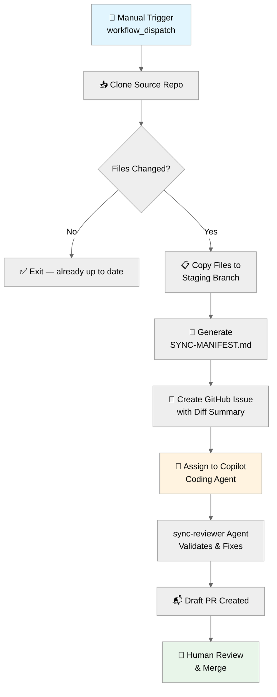
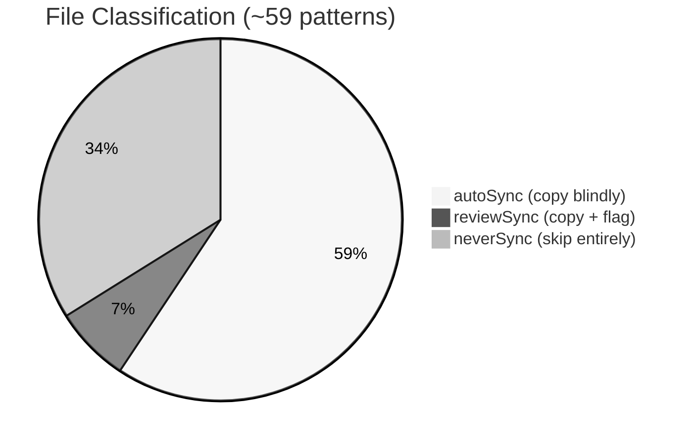
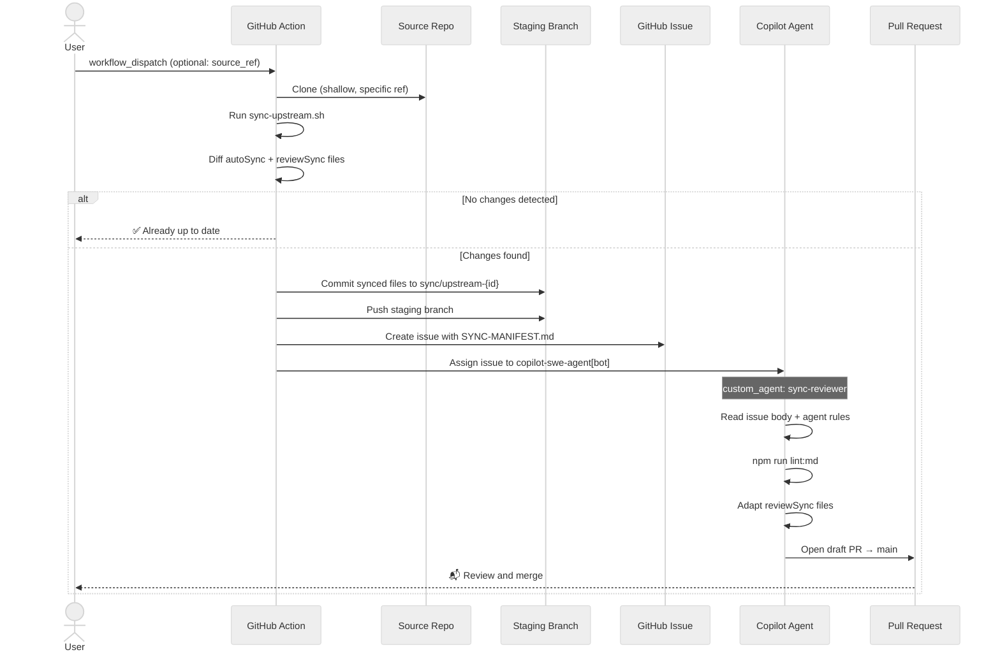

# Upstream Sync

> [Current Version](../VERSION.md) | How upstream changes flow from azure-agentic-infraops to the workshop repo

## Overview

This workshop repository (`azure-agentic-infraops-workshop`) shares agents, skills,
instructions, devcontainer config, and validation scripts with its [upstream source][source-repo].
When the source evolves — new agent capabilities, updated
templates, improved validation — those changes need to flow downstream without
overwriting workshop-specific content like microhack materials and the customized
`docs-writer` skill.

Both repos are owned by the same maintainer — see the [workshop repo][workshop-repo]
for the full microhack experience.

The upstream sync pipeline automates this entire process:

1. A GitHub Action detects what changed upstream
2. Copies sync-safe files to a staging branch
3. Creates a GitHub issue with a diff manifest
4. Assigns the issue to the Copilot coding agent with a purpose-built `sync-reviewer`
   custom agent
5. The agent validates, fixes issues, and opens a draft PR
6. You review and merge

## Architecture



## File Classification

Every file in the source repo falls into one of three tiers. The tiers are
defined in [.sync-config.json](../.sync-config.json) at the workspace root.



### autoSync — Copy Without Question

These files serve the same purpose in both repos and should always track upstream:

| Category     | Examples                                                                          |
| ------------ | --------------------------------------------------------------------------------- |
| Agents       | `.github/agents/**` (11 files)                                                    |
| Instructions | `.github/instructions/**` (15 files)                                              |
| Skills       | `.github/skills/**` (all except `docs-writer` via neverSync)                      |
| DevContainer | `devcontainer.json`, `post-create.sh`, `update-tools.sh`                          |
| VS Code      | `.vscode/**`                                                                      |
| Config       | `lefthook.yml`, `commitlint.config.js`, `.gitattributes`                          |
| Scripts      | `scripts/*.mjs`, `scripts/*.ps1`, `scripts/workflow-generator/*.mjs` etc.         |
| MCP          | `mcp/azure-pricing-mcp/src/**`, `tests/**`, `docs/**`, `scripts/**`, config files |
| Samples      | `agent-output/_sample/**`                                                         |
| Root         | `CONTRIBUTING.md`, `LICENSE`, `requirements.txt`                                  |

### reviewSync — Copy and Flag for Review

These files get copied but the sync-reviewer agent pays extra attention:

| File                              | Why It Needs Review                                              |
| --------------------------------- | ---------------------------------------------------------------- |
| `.github/copilot-instructions.md` | May contain source-specific content needing workshop adaptation  |
| `.devcontainer/README.md`         | May contain source-specific content needing workshop adaptation  |
| `.gitignore`                      | Workshop has extra entries (`SYNC-MANIFEST.md`, agent artifacts) |
| `pyproject.toml`                  | Version number differs; dependencies may be useful               |

### neverSync — Workshop-Only, Never Overwrite

| Category          | Examples                                                                     |
| ----------------- | ---------------------------------------------------------------------------- |
| Identity          | `README.md`, `VERSION.md`, `CHANGELOG.md`, `CONTRIBUTORS.md`, `package.json` |
| Docs-Writer Skill | `.github/skills/docs-writer/**` (customized for workshop)                    |
| Microhack         | `microhack/**` (challenges, facilitator, participant)                        |
| Workshop Docs     | `docs/**` (Know Before You Go, Copilot Guide, etc.)                          |
| Workshop Scripts  | `scripts/microhack/**`                                                       |
| Infrastructure    | `infra/**`                                                                   |

| Workflows | `.github/workflows/**` (workshop manages its own) |
| MCP Archive | `mcp/azure-pricing-mcp/.archive/**`, `.github/**`, `.pre-commit-config.yaml` |
| Binaries | `scripts/workflow-generator/output/**` (generated assets) |

## Workflow Sequence



## Execution Timeline

```mermaid
%%{init: {'theme':'neutral'}}%%
gantt
    title Upstream Sync Timeline
    dateFormat HH:mm
    axisFormat %H:%M

    section GitHub Action
        Clone source repo           :a1, 00:00, 1m
        Run sync script             :a2, after a1, 1m
        Commit to staging branch    :a3, after a2, 30s
        Create issue + assign agent :a4, after a3, 30s

    section Copilot Agent
        Read context and plan       :b1, after a4, 2m
        Run validation suite        :b2, after b1, 3m
        Fix issues in synced files  :b3, after b2, 5m
        Open draft PR               :b4, after b3, 1m

    section Human
        Review PR diff              :c1, after b4, 10m
        Approve and merge           :c2, after c1, 2m
```



> [!TIP]
> Typical end-to-end time is **20–30 minutes**, of which only the final
> review step requires your attention.

## Running the Sync

### From GitHub (recommended)

1. Go to **Actions** → **upstream-sync** → **Run workflow**
2. Optionally set `source_ref` to a specific tag (e.g., `v8.3.0`) or leave
   as `main`
3. Set `dry_run` to `true` for a preview, `false` to execute
4. Click **Run workflow**

After the workflow completes:

- If changes were found, an issue appears in the **Issues** tab
- The Copilot coding agent picks it up within minutes
- A draft PR appears when the agent finishes
- Review the PR diff and merge when satisfied

### Locally (preview only)

```bash
# Preview what would change (no files modified)
./scripts/sync-upstream.sh --dry-run

# Preview from a specific tag
./scripts/sync-upstream.sh --dry-run --ref v8.3.0
```

> [!WARNING]
> Running without `--dry-run` locally will modify your working tree.
> Use the GitHub Action for the full automated pipeline.

## Configuration Reference

The [.sync-config.json](../.sync-config.json) file defines the sync behaviour.

### Structure

```json
{
  "source": {
    "owner": "jonathan-vella",
    "repo": "azure-agentic-infraops",
    "defaultRef": "main"
  },
  "target": {
    "owner": "jonathan-vella",
    "repo": "azure-agentic-infraops-workshop",
    "branchPrefix": "sync/upstream"
  },
  "autoSync": ["<glob patterns>"],
  "reviewSync": ["<glob patterns>"],
  "neverSync": ["<glob patterns>"]
}
```

| Field                          | Purpose                                                     |
| ------------------------------ | ----------------------------------------------------------- |
| `source.owner` / `source.repo` | GitHub coordinates of the upstream repo                     |
| `source.defaultRef`            | Default branch or tag to sync from                          |
| `target.branchPrefix`          | Prefix for staging branches (`sync/upstream-{id}`)          |
| `autoSync`                     | Glob patterns for files copied without question             |
| `reviewSync`                   | Glob patterns for files copied but flagged for agent review |
| `neverSync`                    | Glob patterns for files that are never touched              |

### Adding a New File to Sync

To start syncing a new file from upstream:

1. Add its glob pattern to the `autoSync` array in `.sync-config.json`
2. Commit the config change
3. Run the sync workflow — the file will appear in the next sync

### Protecting a New Workshop File

To prevent a workshop-specific file from being overwritten:

1. Add its glob pattern to the `neverSync` array in `.sync-config.json`
2. Commit the config change

> [!NOTE]
> Patterns use standard glob syntax. Use `**` for recursive matching
> (e.g., `.github/skills/docs-writer/**`) and `*` for single-level
> matching (e.g., `scripts/*.mjs`).

## The sync-reviewer Agent

The `sync-reviewer` is a custom Copilot coding agent assigned by the sync workflow.
Unlike the interactive VS Code agents (Conductor, Architect, etc.), it runs fully
autonomously without approval gates.

It reads:

1. The issue body (diff manifest + requirements + acceptance criteria)
2. `.github/copilot-instructions.md` (repo-wide conventions)
3. `SYNC-MANIFEST.md` on the staging branch

Its rules ensure it:

- Never modifies workshop-specific files
- Runs the full validation suite (`lint:md`, `lint:agent-frontmatter`, `lint:skills-format`)
- Adapts `reviewSync` files for workshop context
- Opens a clean draft PR with a per-file change table

## Prerequisites

### SYNC_PAT Secret

The workflow requires a [fine-grained Personal Access Token][fine-grained-pat] stored as a
repository secret named `SYNC_PAT`.

**Required permissions** (scoped to this repository):

| Permission    | Access         |
| ------------- | -------------- |
| Contents      | Read and write |
| Issues        | Read and write |
| Pull requests | Read and write |
| Metadata      | Read           |

To create the secret:

1. Go to **Settings** → **Secrets and variables** → **Actions**
2. Click **New repository secret**
3. Name: `SYNC_PAT`
4. Value: paste the fine-grained PAT
5. Click **Add secret**

> [!WARNING]
> The default `GITHUB_TOKEN` cannot assign issues to `copilot-swe-agent[bot]`.
> A user-scoped PAT is required for the coding agent assignment API.

### Copilot Coding Agent

The [Copilot coding agent][copilot-coding-agent] must be enabled for the repository:

1. Go to **Settings** → **Copilot** → **Coding agent**
2. Enable "Allow Copilot to open pull requests"

### upstream-sync Label

Create an `upstream-sync` label in the repository for issue tracking:

1. Go to **Issues** → **Labels** → **New label**
2. Name: `upstream-sync`
3. Colour: `#0075ca` (blue)

## Troubleshooting

| Problem                                    | Cause                                             | Fix                                                              |
| ------------------------------------------ | ------------------------------------------------- | ---------------------------------------------------------------- |
| Workflow exits with "No changes detected"  | Source and workshop are already in sync           | Nothing to do — this is expected                                 |
| "Could not assign to Copilot coding agent" | PAT lacks permissions or coding agent is disabled | Check `SYNC_PAT` permissions and enable coding agent in Settings |
| Agent fails or creates empty PR            | Issue body was truncated or agent hit rate limit  | Re-run the workflow; if persistent, manually assign the issue    |
| Lint errors in synced files                | Upstream introduced formatting issues             | Agent should auto-fix; if not, fix manually on the PR branch     |
| PAT expired                                | Fine-grained PATs have configurable expiry        | Regenerate and update the `SYNC_PAT` secret                      |

[source-repo]: https://github.com/jonathan-vella/azure-agentic-infraops
[workshop-repo]: https://github.com/jonathan-vella/azure-agentic-infraops-workshop
[copilot-coding-agent]: https://docs.github.com/en/copilot/using-github-copilot/using-copilot-coding-agent-to-work-on-tasks/about-assigning-tasks-to-copilot
[fine-grained-pat]: https://docs.github.com/en/authentication/keeping-your-account-and-data-secure/managing-your-personal-access-tokens#creating-a-fine-grained-personal-access-token
