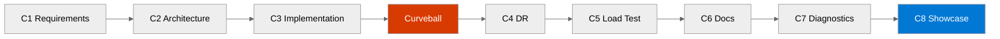

import ChallengeChainTable from "../../../components/ChallengeChainTable.astro";

Eight challenges take you from problem framing to stakeholder defense. Treat this
page as the map for the whole workshop: skim the chain here, then open only the
challenge you are working on.

:::tip

The workshop is now reference-driven by design. Each challenge page tells you what
to do now, what artifact to produce, what decisions matter, and what the next
challenge needs. Use the shared guides only for optional depth or when you hit a
decision you cannot resolve quickly.

:::

## Fast Orientation

1. Start by finding your current challenge in the pipeline below.
2. Check the input artifact and required output before you open the page.
3. Use [Quick Reference Card](../guides/quick-reference-card/) for commands,
   naming, security baselines, Mermaid conventions, and handoff rules.
4. Use [Hints & Tips](../guides/hints-and-tips/) only when you need deeper prompt
   patterns, WAF prompts, governance help, DR guidance, or load-test ideas.

## Challenge Pipeline

Text alternative: challenge pipeline

C1 Requirements -> C2 Architecture -> C3 Implementation -> Curveball -> C4 DR ->
C5 Load Test -> C6 Documentation -> C7 Diagnostics -> C8 Showcase

:::note

Challenge 4 is announced as a surprise midway through the event. If your Challenge 3
deployment did not complete, you still continue by documenting the DR design as a
paper exercise and carrying that design evidence into later challenges.

:::

## Challenge Chain

<ChallengeChainTable />

**Total:** 105 base points + up to 25 bonus points

## Optional Deep Guidance

| Need                                                                                                                                                     | Go here                                                 |
| -------------------------------------------------------------------------------------------------------------------------------------------------------- | ------------------------------------------------------- |
| Commands, naming rules, security baseline, budget guardrails, artifact handoff rules, Mermaid and ADR conventions                                        | [Quick Reference Card](../guides/quick-reference-card/) |
| Prompt patterns, WAF decision prompts, security/compliance questions, governance policy pitfalls, DR thinking, load-test guidance, documentation prompts | [Hints & Tips](../guides/hints-and-tips/)               |
| Broken deployment, policy denial, agent issues, or environment problems                                                                                  | [Troubleshooting](../reference/troubleshooting/)        |

## Read This Way

Keep the challenge page as your execution surface.

- Read the fast block at the top of the challenge page first.
- Do the required tasks before opening any collapsed hint section.
- Open the shared guides only when you need extra depth, not as required reading.
- Preserve your output artifact names and paths exactly so later challenges can find them.
