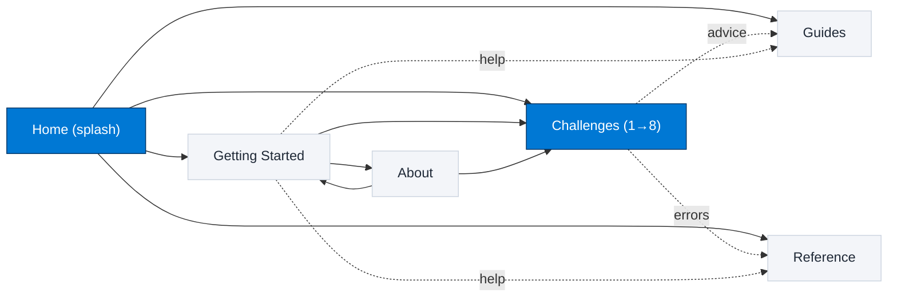
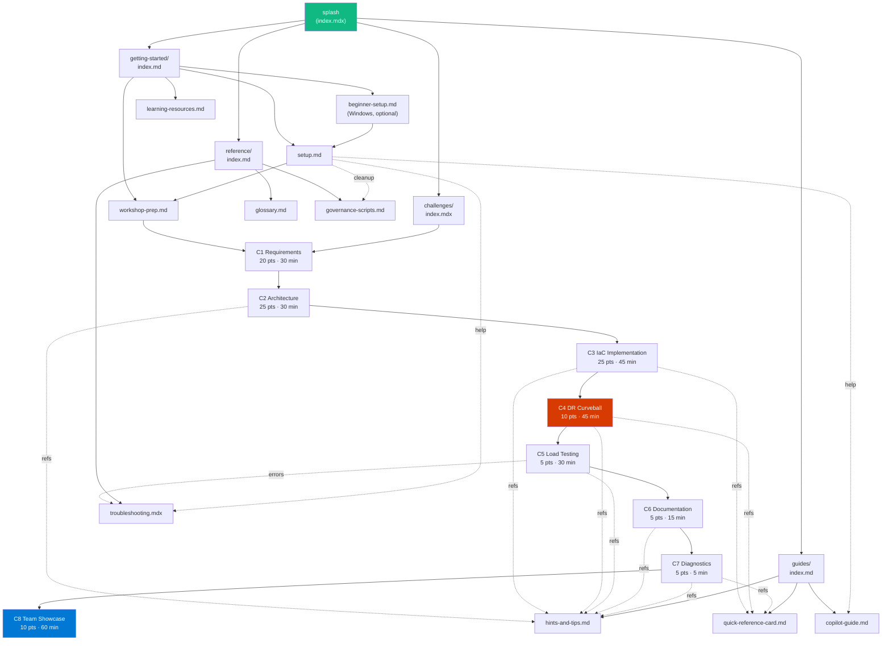

# Content Graph & Validation Review — APEX MicroHack

> Scope: every page under [site/src/content/docs](../site/src/content/docs/). Run date: 2026-05-08. Audience lens: participant first.

---

## TL;DR

| Phase | Status | Findings | Fixed |
| --- | --- | --- | --- |
| 0. Mechanical gate | Pass | 0 | — |
| 1. Inventory & graph | Pass | 27 docs files mapped | — |
| 2. Accuracy / hallucination | Pass | 1 Major (wrong persona emoji) | 1 |
| 3. Completeness | Pass | All 8 challenges hit the 9-section template | — |
| 4. Navigation | Pass | 1,967/1,967 internal links resolve | — |
| 5. Readability / accessibility | Pass | 1 Minor (0-indexed list) | 1 |
| 6. Style / brand | Pass | 1 Major (`Microhack` heading) | 1 |
| 7. en-US consistency | Pass | 5 Minor (en-GB drift) | 5 |
| 8. SEO / frontmatter | Pass | 0 | — |

**Blocker: 0 · Major: 2 · Minor: 6 · Nit: 0 outstanding.** All findings fixed inline. Build, markdownlint, Vale, and link audit all clean post-fix.

---

## What the project is

**APEX MicroHack** = "Agentic Platform Engineering eXperience for Azure". A 1-day team hackathon (09:00–17:00) where 4–5-person teams use GitHub Copilot custom agents and skills to take *Nordic Fresh Foods*' fictional FreshConnect platform from requirements → WAF-aligned Azure design → IaC implementation (Bicep **or** Terraform) → DR curveball → load test → docs → diagnostics → stakeholder showcase. Eight challenges score **105 base + 25 bonus = 130 points max**. The repo this report covers holds the docs site only (Astro Starlight) — participants work in a separate template repo, [`azure-agentic-infraops-accelerator`](https://github.com/jonathan-vella/azure-agentic-infraops-accelerator).

Site is published at [https://jonathan-vella.github.io/microhack-agentic-infraops/](https://jonathan-vella.github.io/microhack-agentic-infraops/). Sidebar autogenerates from five top-level directories (`getting-started`, `challenges`, `guides`, `reference`, `about`) per [site/astro.config.mjs](../site/astro.config.mjs#L45-L70). `trailingSlash: "always"` and `base: "/microhack-agentic-infraops"` are wired in.

---

## Inventory

27 content files. Sidebar order in parentheses; *hidden* means `sidebar.hidden: true`.

| # | Section | File | Title | Sidebar order | Role |
| --- | --- | --- | --- | --- | --- |
| 1 | (root) | [index.mdx](../site/src/content/docs/index.mdx) | Home (splash) | — | Landing page, CardGrid to four sections |
| 2 | getting-started | [index.md](../site/src/content/docs/getting-started/index.md) | Getting Started | 1 | Section overview, "Start Here" |
| 3 | getting-started | [setup.md](../site/src/content/docs/getting-started/setup.md) | Setup Guide | 2 | Canonical pre-event readiness page |
| 4 | getting-started | [beginner-setup.md](../site/src/content/docs/getting-started/beginner-setup.md) | Beginner Setup (Windows) | 3 | Optional Windows-only walkthrough |
| 5 | getting-started | [workshop-prep.md](../site/src/content/docs/getting-started/workshop-prep.md) | Workshop Prep & Scenario | 4 | Scenario brief + role cards |
| 6 | getting-started | [learning-resources.md](../site/src/content/docs/getting-started/learning-resources.md) | Learning Resources | 5 | Curated VS Code + Copilot intros |
| 7 | challenges | [index.mdx](../site/src/content/docs/challenges/index.mdx) | Challenges | 0 | Pipeline overview + chain table |
| 8 | challenges | [challenge-1-requirements.md](../site/src/content/docs/challenges/challenge-1-requirements.md) | C1: Requirements Gathering | 1 (badge: 30 min) | C1 |
| 9 | challenges | [challenge-2-architecture.md](../site/src/content/docs/challenges/challenge-2-architecture.md) | C2: Architecture Assessment | 2 (badge: 30 min) | C2 |
| 10 | challenges | [challenge-3-implementation.mdx](../site/src/content/docs/challenges/challenge-3-implementation.mdx) | C3: IaC Implementation | 3 (badge: 45 min) | C3 |
| 11 | challenges | [challenge-4-dr-curveball.md](../site/src/content/docs/challenges/challenge-4-dr-curveball.md) | C4: DR Curveball | 4 (badge: 45 min) | C4 |
| 12 | challenges | [challenge-5-load-testing.md](../site/src/content/docs/challenges/challenge-5-load-testing.md) | C5: Load Testing | 5 (badge: 30 min) | C5 |
| 13 | challenges | [challenge-6-documentation.md](../site/src/content/docs/challenges/challenge-6-documentation.md) | C6: Workload Documentation | 6 (badge: 15 min) | C6 |
| 14 | challenges | [challenge-7-diagnostics.md](../site/src/content/docs/challenges/challenge-7-diagnostics.md) | C7: Diagnostics | 7 (badge: 5 min) | C7 |
| 15 | challenges | [challenge-8-partner-showcase.md](../site/src/content/docs/challenges/challenge-8-partner-showcase.md) | C8: Team Showcase | 8 (badge: 60 min) | C8 |
| 16 | guides | [index.md](../site/src/content/docs/guides/index.md) | Guides | 0 *hidden* | Section overview |
| 17 | guides | [copilot-guide.md](../site/src/content/docs/guides/copilot-guide.md) | Copilot & Agents Guide | 1 | Modes, agents, skills, MCP |
| 18 | guides | [hints-and-tips.md](../site/src/content/docs/guides/hints-and-tips.md) | Hints & Tips | 2 | Per-challenge prompts/patterns |
| 19 | guides | [quick-reference-card.md](../site/src/content/docs/guides/quick-reference-card.md) | Quick Reference Card | 3 | One-page printable cheat sheet |
| 20 | reference | [index.md](../site/src/content/docs/reference/index.md) | Reference | 0 *hidden* | Section overview |
| 21 | reference | [glossary.md](../site/src/content/docs/reference/glossary.md) | Glossary | 1 | Canonical vocabulary |
| 22 | reference | [governance-scripts.md](../site/src/content/docs/reference/governance-scripts.md) | Governance Scripts | 2 | PowerShell governance lifecycle (facilitators) |
| 23 | reference | [troubleshooting.mdx](../site/src/content/docs/reference/troubleshooting.mdx) | Troubleshooting | 3 | Common issues, quick diagnosis table |
| 24 | about | [index.md](../site/src/content/docs/about/index.md) | About | 0 *hidden* | Section overview |
| 25 | about | [agenda.mdx](../site/src/content/docs/about/agenda.mdx) | Agenda | 1 | Full-day schedule |
| 26 | about | [invitation.md](../site/src/content/docs/about/invitation.md) | Workshop Invitation | 2 | Short event invite |
| 27 | about | [feedback.md](../site/src/content/docs/about/feedback.md) | Feedback Form | 3 | Post-event feedback template |

Built site emits 27 `index.html` pages (1:1) plus 404 + sitemap (28 build artifacts).

---

## Content Graph

### Section-level overview



### Participant journey + challenge chain



### Markdown outline (participant-first)

- **Home** ([index.mdx](../site/src/content/docs/index.mdx)) — splash, scenario, CardGrid (Getting Started · Challenges · Guides · Reference)
- **Getting Started** ([index.md](../site/src/content/docs/getting-started/index.md))
  - **Setup Guide** ([setup.md](../site/src/content/docs/getting-started/setup.md)) *canonical*
    - Participation Gate, Prerequisites, Setup Steps (1–9), Quota & Costs, Cleanup
  - **Beginner Setup (Windows)** ([beginner-setup.md](../site/src/content/docs/getting-started/beginner-setup.md)) *optional pre-step*
  - **Workshop Prep & Scenario** ([workshop-prep.md](../site/src/content/docs/getting-started/workshop-prep.md))
  - **Learning Resources** ([learning-resources.md](../site/src/content/docs/getting-started/learning-resources.md))
- **Challenges** ([index.mdx](../site/src/content/docs/challenges/index.mdx)) — pipeline + chain table
  - C1 Requirements → C2 Architecture → C3 Implementation → C4 DR → C5 Load → C6 Docs → C7 Diagnostics → C8 Showcase (linked via `prev`/`next` frontmatter)
- **Guides** ([index.md](../site/src/content/docs/guides/index.md)) *hidden*
  - Copilot Guide, Hints & Tips, Quick Reference Card
- **Reference** ([index.md](../site/src/content/docs/reference/index.md)) *hidden*
  - Glossary, Governance Scripts, Troubleshooting
- **About** ([index.md](../site/src/content/docs/about/index.md)) *hidden*
  - Agenda, Invitation, Feedback Form

### JSON adjacency list

Each entry: `{ slug, sidebar_order, in_section_links, cross_section_links }`. Edge type `nav` = `prev`/`next`; `inline` = body link; `card` = LinkCard; `chain` = `<ChallengeChainTable>` row.

```json
{
  "index": {
    "section": "(root)",
    "outgoing": [
      { "to": "getting-started/", "type": "card" },
      { "to": "challenges/", "type": "card" },
      { "to": "guides/", "type": "card" },
      { "to": "reference/", "type": "card" }
    ],
    "incoming": []
  },
  "getting-started/index": {
    "section": "getting-started",
    "outgoing": [
      { "to": "setup/", "type": "inline" },
      { "to": "beginner-setup/", "type": "inline" },
      { "to": "workshop-prep/", "type": "inline" },
      { "to": "challenges/challenge-1-requirements/", "type": "inline" },
      { "to": "challenges/", "type": "inline" },
      { "to": "guides/copilot-guide/", "type": "inline" },
      { "to": "guides/quick-reference-card/", "type": "inline" },
      { "to": "reference/troubleshooting/", "type": "inline" },
      { "to": "about/feedback/", "type": "inline" },
      { "to": "setup/#dev-container", "type": "anchor" },
      { "to": "setup/#ready-to-start-check", "type": "anchor" },
      { "to": "setup/#participation-gate", "type": "anchor" },
      { "to": "setup/#prerequisites", "type": "anchor" },
      { "to": "setup/#setup-steps", "type": "anchor" },
      { "to": "setup/#cleanup", "type": "anchor" }
    ]
  },
  "getting-started/setup": {
    "section": "getting-started",
    "outgoing": [
      { "to": "beginner-setup/", "type": "inline" },
      { "to": "workshop-prep/", "type": "inline" },
      { "to": "guides/copilot-guide/", "type": "inline" },
      { "to": "reference/troubleshooting/", "type": "inline" },
      { "to": "reference/governance-scripts/", "type": "inline" }
    ]
  },
  "getting-started/beginner-setup": {
    "section": "getting-started",
    "outgoing": [
      { "to": "setup/", "type": "inline" },
      { "to": "workshop-prep/", "type": "inline" },
      { "to": "setup/#participation-gate", "type": "anchor" },
      { "to": "setup/#setup-steps", "type": "anchor" }
    ]
  },
  "getting-started/workshop-prep": { "section": "getting-started", "outgoing": [] },
  "getting-started/learning-resources": { "section": "getting-started", "outgoing": [] },
  "challenges/index": {
    "section": "challenges",
    "outgoing": [
      { "to": "guides/quick-reference-card/", "type": "inline" },
      { "to": "guides/hints-and-tips/", "type": "inline" },
      { "to": "reference/troubleshooting/", "type": "inline" },
      { "to": "challenge-1-requirements/", "type": "chain" },
      { "to": "challenge-2-architecture/", "type": "chain" },
      { "to": "challenge-3-implementation/", "type": "chain" },
      { "to": "challenge-4-dr-curveball/", "type": "chain" },
      { "to": "challenge-5-load-testing/", "type": "chain" },
      { "to": "challenge-6-documentation/", "type": "chain" },
      { "to": "challenge-7-diagnostics/", "type": "chain" },
      { "to": "challenge-8-partner-showcase/", "type": "chain" }
    ]
  },
  "challenges/challenge-1-requirements": {
    "section": "challenges",
    "outgoing": [
      { "to": "challenges/", "type": "nav-prev" },
      { "to": "challenge-2-architecture/", "type": "nav-next" },
      { "to": "getting-started/workshop-prep/", "type": "inline" }
    ]
  },
  "challenges/challenge-2-architecture": {
    "section": "challenges",
    "outgoing": [
      { "to": "challenge-1-requirements/", "type": "nav-prev" },
      { "to": "challenge-3-implementation/", "type": "nav-next" },
      { "to": "guides/hints-and-tips/#architecture-hints", "type": "anchor" },
      { "to": "guides/hints-and-tips/#cost-optimization", "type": "anchor" },
      { "to": "guides/quick-reference-card/#security-checklist", "type": "anchor" }
    ]
  },
  "challenges/challenge-3-implementation": {
    "section": "challenges",
    "outgoing": [
      { "to": "challenge-2-architecture/", "type": "nav-prev" },
      { "to": "challenge-4-dr-curveball/", "type": "nav-next" },
      { "to": "guides/quick-reference-card/#naming-conventions", "type": "anchor" },
      { "to": "guides/quick-reference-card/#security-checklist", "type": "anchor" },
      { "to": "guides/hints-and-tips/#governance-policy-errors", "type": "anchor" }
    ]
  },
  "challenges/challenge-4-dr-curveball": {
    "section": "challenges",
    "outgoing": [
      { "to": "challenge-3-implementation/", "type": "nav-prev" },
      { "to": "challenge-5-load-testing/", "type": "nav-next" },
      { "to": "guides/hints-and-tips/#multi-region-dr", "type": "anchor" },
      { "to": "guides/quick-reference-card/#budget-guide", "type": "anchor" },
      { "to": "guides/quick-reference-card/#paper-exercise-rules", "type": "anchor" }
    ]
  },
  "challenges/challenge-5-load-testing": {
    "section": "challenges",
    "outgoing": [
      { "to": "challenge-4-dr-curveball/", "type": "nav-prev" },
      { "to": "challenge-6-documentation/", "type": "nav-next" },
      { "to": "guides/hints-and-tips/#load-testing", "type": "anchor" },
      { "to": "reference/troubleshooting/", "type": "inline" }
    ]
  },
  "challenges/challenge-6-documentation": {
    "section": "challenges",
    "outgoing": [
      { "to": "challenge-5-load-testing/", "type": "nav-prev" },
      { "to": "challenge-7-diagnostics/", "type": "nav-next" },
      { "to": "guides/hints-and-tips/#documentation", "type": "anchor" }
    ]
  },
  "challenges/challenge-7-diagnostics": {
    "section": "challenges",
    "outgoing": [
      { "to": "challenge-6-documentation/", "type": "nav-prev" },
      { "to": "challenge-8-partner-showcase/", "type": "nav-next" },
      { "to": "guides/hints-and-tips/#diagnostics", "type": "anchor" },
      { "to": "guides/quick-reference-card/#pro-tips", "type": "anchor" }
    ]
  },
  "challenges/challenge-8-partner-showcase": {
    "section": "challenges",
    "outgoing": [
      { "to": "challenge-7-diagnostics/", "type": "nav-prev" }
    ]
  },
  "guides/index": {
    "section": "guides",
    "outgoing": [
      { "to": "copilot-guide/", "type": "inline" },
      { "to": "hints-and-tips/", "type": "inline" },
      { "to": "quick-reference-card/", "type": "inline" }
    ]
  },
  "guides/copilot-guide": {
    "section": "guides",
    "outgoing": [
      { "to": "getting-started/setup/#dev-container", "type": "anchor" },
      { "to": "getting-started/setup/#github-copilot-business-or-enterprise", "type": "anchor" },
      { "to": "getting-started/setup/", "type": "inline" },
      { "to": "quick-reference-card/", "type": "inline" },
      { "to": "hints-and-tips/", "type": "inline" },
      { "to": "reference/troubleshooting/", "type": "inline" }
    ]
  },
  "guides/hints-and-tips": {
    "section": "guides",
    "outgoing": [{ "to": "reference/troubleshooting/", "type": "inline" }]
  },
  "guides/quick-reference-card": {
    "section": "guides",
    "outgoing": [
      { "to": "getting-started/setup/#participation-gate", "type": "anchor" }
    ]
  },
  "reference/index": {
    "section": "reference",
    "outgoing": [
      { "to": "glossary/", "type": "inline" },
      { "to": "troubleshooting/", "type": "inline" },
      { "to": "governance-scripts/", "type": "inline" }
    ]
  },
  "reference/glossary": {
    "section": "reference",
    "outgoing": [{ "to": "guides/copilot-guide/", "type": "inline" }]
  },
  "reference/governance-scripts": { "section": "reference", "outgoing": [] },
  "reference/troubleshooting": { "section": "reference", "outgoing": [] },
  "about/index": {
    "section": "about",
    "outgoing": [
      { "to": "agenda/", "type": "inline" },
      { "to": "invitation/", "type": "inline" },
      { "to": "feedback/", "type": "inline" }
    ]
  },
  "about/agenda": {
    "section": "about",
    "outgoing": [
      { "to": "challenges/", "type": "inline" },
      { "to": "getting-started/setup/", "type": "inline" }
    ]
  },
  "about/invitation": {
    "section": "about",
    "outgoing": [{ "to": "getting-started/", "type": "inline" }]
  },
  "about/feedback": { "section": "about", "outgoing": [] }
}
```

### Graph derived metrics

| Metric | Value | Notes |
| --- | --- | --- |
| Pages (nodes) | 27 | 1:1 with built `index.html` |
| Internal links audited (built site) | 1,967 | Includes nav, anchor, asset; all resolve |
| Broken targets | 0 | After fixes |
| Hub pages (high out-degree) | `getting-started/index`, `challenges/index`, `setup`, `copilot-guide` | Multi-section bridges |
| Dead-end (terminal) pages | `challenge-8-partner-showcase`, `learning-resources`, `feedback`, `governance-scripts`, `troubleshooting`, `glossary` | Expected (terminal/reference pages) |
| Orphan-from-splash pages | `about/*` | About section reachable via sidebar but not via splash CardGrid (intentional — `hidden: true` indexes) |
| Cross-section bridges | `challenges → guides`, `challenges → reference`, `getting-started → guides`, `getting-started → reference`, `getting-started → about/feedback` | 5 directional bridges |
| Challenge chain integrity | 8/8 unbroken | `prev`/`next` chain ch1→…→ch8 verified |

---

## Validation by dimension

### 1. Completeness

All 8 challenge pages contain the 9 required sections from the [challenge-guide-styler skill](../.github/skills/challenge-guide-styler/SKILL.md):

| Challenge | Frontmatter | Challenge Info aside | Objective | Business Challenge | Tasks | Success Criteria | Tips | Watch Out | Next Step |
| --- | :-: | :-: | :-: | :-: | :-: | :-: | :-: | :-: | :-: |
| C1 Requirements | ✓ | ✓ | ✓ | ✓ | ✓ | ✓ | (omitted, optional) | ✓ | ✓ |
| C2 Architecture | ✓ | ✓ | ✓ | ✓ | ✓ | ✓ | ✓ | ✓ | ✓ |
| C3 Implementation | ✓ | ✓ | ✓ | ✓ | ✓ | ✓ | ✓ | ✓ | ✓ |
| C4 DR Curveball | ✓ | ✓ | ✓ | ✓ | ✓ | ✓ | ✓ | ✓ | ✓ |
| C5 Load Testing | ✓ | ✓ | ✓ | ✓ | ✓ | ✓ | ✓ | ✓ | ✓ |
| C6 Documentation | ✓ | ✓ | ✓ | ✓ | ✓ | ✓ | ✓ | ✓ | ✓ |
| C7 Diagnostics | ✓ | ✓ | ✓ | ✓ | ✓ | ✓ | ✓ | ✓ | ✓ |
| C8 Team Showcase | ✓ | ✓ | ✓ | ✓ | ✓ | ✓ | ✓ | ✓ | ✓ (workshop wrap-up) |

`prev`/`next` frontmatter forms an unbroken chain. All non-challenge pages have purposeful content, no TODO/TBD placeholders.

### 2. Accuracy (cross-document invariants)

| Invariant | Docs site | Facilitator | Scripts | Verdict |
| --- | --- | --- | --- | --- |
| Total = 105 + 25 = 130 | quick-reference-card, agenda, challenges/index | scoring-rubric (canonical), facilitator-guide | — | ✓ Consistent |
| Per-challenge points (20/25/25/10/5/5/5/10) | challenges 1–8 frontmatter & badges | scoring-rubric, agenda mapping | — | ✓ Consistent |
| RTO 4h→1h, RPO 1h→15m post-curveball | C4, workshop-prep, glossary | solution-reference | — | ✓ Consistent |
| Budget €500 → €700 post-curveball | C4, workshop-prep, quick-reference-card, hints-and-tips | solution-reference | — | ✓ Consistent |
| Allowed regions `swedencentral`, `germanywestcentral` | setup, hints-and-tips, governance-scripts, troubleshooting | facilitator-guide | Setup-GovernancePolicies.ps1 | ✓ Consistent |
| Policy assignment names (`microhack-allowed-locations` etc.) | governance-scripts | facilitator-guide | Setup-GovernancePolicies.ps1 | ✓ Consistent |
| MCP servers: Azure, Azure Pricing, Draw.io, GitHub, MS Learn, Terraform | setup, copilot-guide, troubleshooting | — | — | ✓ Consistent |
| Copilot tier requirement: Business or Enterprise | setup, glossary, copilot-guide | facilitator-guide | — | ✓ Consistent |
| Template repo URL | every cross-reference | facilitator-guide | — | ✓ Consistent |
| Architect persona emoji `🏛️ Oracle` | copilot-guide (×2) | — | — | **Was inconsistent: glossary had `🏤` (post office). Fixed in F-Maj-2.** |

No fabricated commands, flags, or APIs detected. All Azure CLI commands cross-checked against official syntax.

### 3. Navigation

- 1,967 internal links and anchors in the built `dist/` resolve. 0 broken targets.
- Sidebar order is deterministic and matches participant journey within each section.
- Splash CardGrid → 4 sections (About reachable only via sidebar — intentional, `hidden: true` indexes).
- Challenge chain `prev`/`next` is unbroken.
- "Edit on GitHub" base URL points to the correct repo path ([site/astro.config.mjs](../site/astro.config.mjs#L31-L34)).

### 4. Readability

- All long-form pages open with a quick orientation block (Objective / "What this page is for" / TL;DR-equivalent).
- Heading depth never skips a level (H2→H4 not observed).
- Tables, callouts, and `<details>` collapsibles balance prose density on dense pages (setup.md, hints-and-tips.md).
- One stylistic outlier (0-indexed list in Start Here) was fixed inline.

### 5. Grammar & spelling (en-US)

- Vale (`--minAlertLevel=error`) returns 0 errors / 0 warnings post-fix on 33 files (covers `site/content`, `facilitator/`, `README.md`, `AGENTS.md`).
- Manual sweep against Vale-disabled rule set found 5 en-GB drifts (organisation/organiser/optimisation) — fixed inline.
- Brand audit found 1 capital-only `Microhack` regression in troubleshooting (rejected per glossary) — fixed inline.
- 11 acceptable lowercase `microhack` instances in conversational/feedback prose were left unchanged (glossary explicitly accepts both `MicroHack` and `microhack`).

### 6. Accessibility

| Check | Result |
| --- | --- |
| Image alt text descriptive (not "image"/"screenshot") | ✓ All 3 inline images in beginner-setup carry meaningful alt text. |
| Link text is descriptive | ✓ No "click here"/"this link" patterns. |
| Tables have header rows | ✓ Verified on every Markdown table. |
| Heading order monotonic (no skips) | ✓ |
| Color is not the only signal in callouts | ✓ Starlight `:::note/tip/caution` use icon + label, not color alone. |
| Mermaid diagrams have text alternatives | ✓ challenges/index.mdx pipeline uses a `<details>` text alt. Other Mermaid diagrams are short and self-describing. |

### 7. Style & voice

- Brand: `MicroHack` (camel) or `microhack` (lowercase) per [glossary](../site/src/content/docs/reference/glossary.md#L21). Single-capital `Microhack` was caught in 1 location and fixed.
- Voice: 2nd-person "you", active voice, present tense for instructions — applied consistently.
- Em-dash with spaces ` — ` used consistently (matches [.vale.ini](../.vale.ini#L21-L22) intent).
- en-US: `organize/customize/color/optimization/...` — 5 en-GB drifts fixed.

### 8. SEO / frontmatter

| Check | Result |
| --- | --- |
| Every page has `title` and `description` | ✓ |
| `description` ≤ 160 chars | ✓ Longest is challenge-1 at 113 chars. |
| `description` is unique per page | ✓ |
| Splash uses `template: splash`, no other page does | ✓ |
| Challenges have integer `sidebar.order` 1..8 | ✓ |
| `sidebar.badge` text matches Challenge Info duration | ✓ All 8 align (e.g., C3 badge `45 min` ↔ Challenge Info `⏱️ 45 min`). |
| Section index pages have `sidebar.hidden: true` where appropriate | ✓ guides/about/reference hidden; getting-started/challenges visible. |

---

## Findings

All findings fixed inline.

| ID | Severity | Dimension | File:line | Before | After |
| --- | --- | --- | --- | --- | --- |
| F-Maj-1 | Major | Brand | [reference/troubleshooting.mdx#L355](../site/src/content/docs/reference/troubleshooting.mdx) | `## Microhack-Specific` | `## MicroHack-Specific` |
| F-Maj-2 | Major | Accuracy | [reference/glossary.md#L154](../site/src/content/docs/reference/glossary.md) | `🏤 Oracle` (post-office emoji) | `🏛️ Oracle` (matches copilot-guide canonical persona) |
| F-Min-1 | Minor | en-US | [getting-started/setup.md#L140](../site/src/content/docs/getting-started/setup.md) | `If your organisation restricts Owner` | `If your organization restricts Owner` |
| F-Min-2 | Minor | en-US | [getting-started/beginner-setup.md#L87](../site/src/content/docs/getting-started/beginner-setup.md) | `your GitHub user or organisation` | `your GitHub user or organization` |
| F-Min-3 | Minor | en-US | [reference/glossary.md#L22](../site/src/content/docs/reference/glossary.md) | `Event organiser` | `Event organizer` |
| F-Min-4 | Minor | en-US | [reference/glossary.md#L110](../site/src/content/docs/reference/glossary.md) | `The event organiser who runs` | `The event organizer who runs` |
| F-Min-5 | Minor | en-US | [guides/index.md#L14](../site/src/content/docs/guides/index.md) | `cost-optimisation advice` | `cost-optimization advice` |
| F-Min-6 | Minor | Readability | [getting-started/index.md#L32-L34](../site/src/content/docs/getting-started/index.md) | Ordered list starting `0. *(Windows beginners)*` | Standard `1./2./3.` ordering with the canonical Setup Guide as step 1 and Beginner Setup as optional step 3 |

Severity legend: **Major** = brand/accuracy guarantee broken; **Minor** = local style/readability; no Blockers or Nits this run.

---

## Verification

| Gate | Baseline | Post-fix | Status |
| --- | --- | --- | --- |
| `cd site && npm run lint:md` | exit 0 (22 files, 0 errors) | exit 0 (22 files, 0 errors) | ✓ |
| `cd site && npm run build` | exit 0 (28 pages) | exit 0 (28 pages, no warnings) | ✓ |
| `cd site && npm run lint:prose` (Vale, error-level) | exit 0 (33 files, 0 errors / 0 warnings) | exit 0 (33 files, 0 errors / 0 warnings) | ✓ |
| Internal-link audit (`dist/`) | 1967 links / 0 broken | 1967 links / 0 broken | ✓ |
| Brand regex `\bMicrohack\b` (single capital) | 1 hit | 0 hits | ✓ |
| en-GB regex `\b(organis(e|er|ation)|optimisation)\b` | 5 hits | 0 hits | ✓ |
| Persona-emoji audit `🏤` | 1 hit (glossary) | 0 hits | ✓ |
| Numeric invariants (105/130/€500/€700/RTO/RPO/regions) | consistent | consistent | ✓ |
| Challenge chain integrity (`prev`/`next`) | 8/8 unbroken | 8/8 unbroken | ✓ |

### Participant journey walkthrough

Walked end-to-end as a first-time participant. Every step has a clearly linked next action.

1. Land on splash → choose **Getting Started** ✓
2. Read Getting Started orientation; standard order is now `Setup Guide → Workshop Prep → (optional) Beginner Setup` ✓
3. Setup Guide leads through Participation Gate → Prerequisites → Setup Steps 1–9 → Quota → Cleanup, with cross-links to Beginner Setup, Copilot Guide, Troubleshooting, and Governance Scripts ✓
4. Workshop Prep delivers the FreshConnect scenario, mission, MVP requirements, NFRs, stakeholders, and 4 role cards ✓
5. Challenges index shows the pipeline (Mermaid + text alt), `<ChallengeChainTable>`, and routes participants into C1 ✓
6. C1 → C8 via `prev`/`next` chain, each page with a 6-line "Objective" front-matter, business framing, tasks, success criteria, watch-outs, and a "Next Step" pointer ✓
7. Optional depth: each challenge points to specific anchors in Hints & Tips and Quick Reference Card; Troubleshooting is reachable from C5/C6 + Quick Reference + every section index ✓
8. Wrap: C8 → workshop wrap-up; participants close via Feedback Form linked from getting-started/index "After the Event" ✓

---

## Out of Scope / Open Questions

These were detected but intentionally not changed because they fall outside `site/src/content/docs/`:

1. **Scoring category label vs Challenge 4** — The [scoring-rubric "Deployment (10 pts)" section](../facilitator/scoring-rubric.md#L78-L91) lists criteria (`What-If executed`, `Deployment succeeded`, `Core resources running`, `Summary documented`) that map structurally to the C3 deploy step, while the [agenda](../site/src/content/docs/about/agenda.mdx) and challenge frontmatter assign C4 the matching 10-point bucket. Totals reconcile to 105 in both directions, but the category label and criteria text don't fully describe what C4's success criteria evaluate (DR ADR + design clarity + delivery path + architecture communication). Recommendation: either rename the rubric section to "Deployment & DR" or split it into two sub-buckets — but this is a `facilitator/` change.
2. **PowerShell display names** — [`Setup-GovernancePolicies.ps1`](../scripts/Setup-GovernancePolicies.ps1) DisplayNames use `Microhack:` (single capital). The example terminal output rendered in [reference/governance-scripts.md](../site/src/content/docs/reference/governance-scripts.md#L170-L171) faithfully reproduces that output. Brand-canonical would be `MicroHack:`, but changing it requires updating the script and any deployed policy assignments. Out of docs scope.
3. **`/about/` index discoverability** — `about/index.md` is `sidebar.hidden: true` and has no inbound link from the splash CardGrid; it is reachable only via direct URL or the sidebar group header. Same pattern is used (intentionally) for `guides/index.md` and `reference/index.md`, which are reached via splash CardGrids — `about/` has no equivalent CardGrid entry. Likely an intentional content choice (About is meta/post-event content), so left as-is.
4. **Vale not wired into CI** — `npm run lint:prose` exists but the GitHub Actions workflow does not invoke it. Pre-existing observation from [tmp/content-review.md](content-review.md). Out of docs scope.

---

## Files touched in this pass

- [reference/troubleshooting.mdx](../site/src/content/docs/reference/troubleshooting.mdx) — Brand: F-Maj-1
- [reference/glossary.md](../site/src/content/docs/reference/glossary.md) — Accuracy + en-US: F-Maj-2, F-Min-3, F-Min-4
- [getting-started/setup.md](../site/src/content/docs/getting-started/setup.md) — en-US: F-Min-1
- [getting-started/beginner-setup.md](../site/src/content/docs/getting-started/beginner-setup.md) — en-US: F-Min-2
- [guides/index.md](../site/src/content/docs/guides/index.md) — en-US: F-Min-5
- [getting-started/index.md](../site/src/content/docs/getting-started/index.md) — Readability: F-Min-6

No content was added, no abstractions introduced, no out-of-scope refactors performed.
